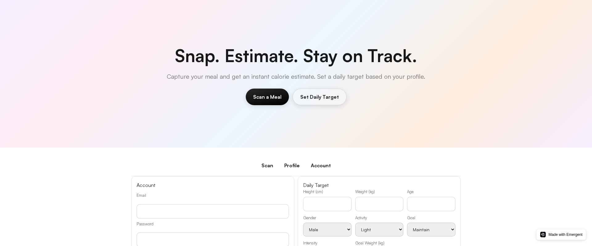
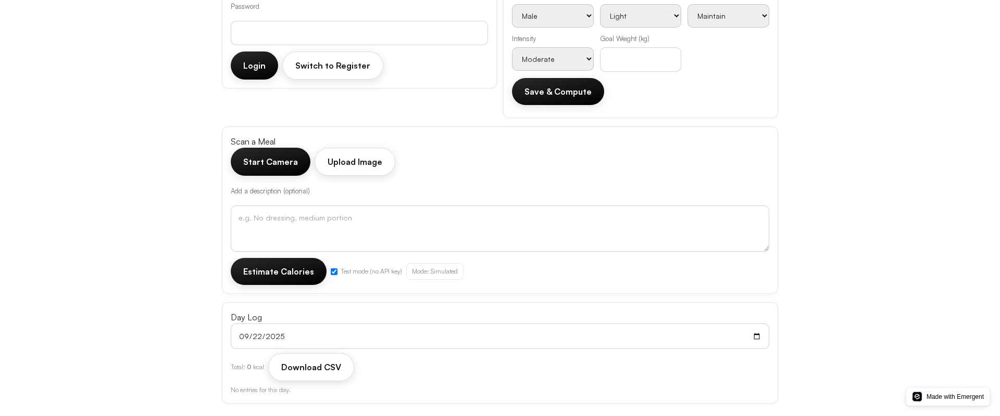
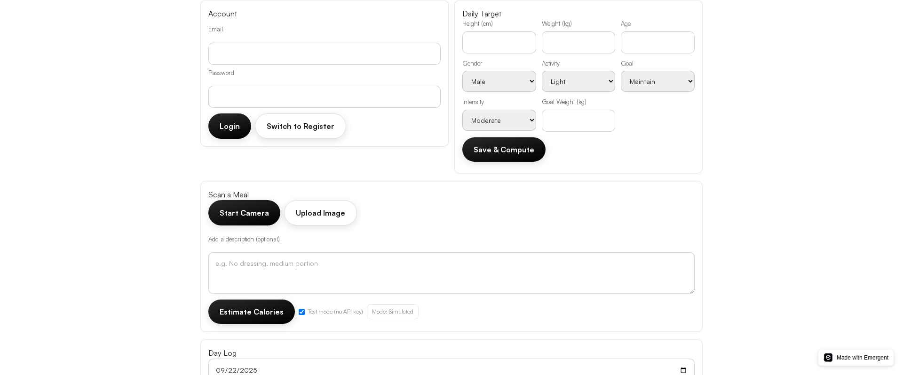

# Calorie Tracker (Camera + AI)

A full‑stack calories counter with: camera upload, AI food recognition (gpt‑4o), Day Log with totals, daily target via profile, CSV export, and timezone‑correct logging. Built with React + FastAPI + MongoDB.

Live Frontend: configured via frontend/.env (REACT_APP_BACKEND_URL). All backend endpoints are under /api.

## Screenshots

Hero & Navigation

Scanner & Day Log (mobile‑friendly)

Account (Auth)

Profile (Daily Target)

## Features
- Email/password auth (JWT). Centralized Axios client auto‑injects Authorization. 401 → session‑expired event.
- Profile & Daily Target: Mifflin–St Jeor + activity + goal adjustments.
- Camera capture + image upload. Always render video/canvas to avoid ref timing errors.
- AI calories estimate (gpt‑4o via emergentintegrations). Strict JSON response with retry + conservative fallback.
- Key policy: Test mode (simulated), Live with provided key (no fallback), Live with empty key → Emergent LLM Key.
- Day Log: save meals (items, notes, base64 image), list by local day with daily total + progress bar, delete entries, CSV export.
- Timezone: UI saves captured_at with local offset; backend stores created_at (tz‑aware) and display_local; queries use tz_offset_minutes; UI shows human‑friendly local times; CSV uses local ISO with offset.

## Getting Started

Prerequisites
- Node 18+ and Yarn
- Python 3.11+
- MongoDB (use backend/.env MONGO_URL)

1) Environment
- Frontend: set REACT_APP_BACKEND_URL in frontend/.env to your ingress URL
- Backend: set MONGO_URL and (optional) EMERGENT_LLM_KEY in backend/.env
- All backend routes are under /api

2) Install
- Frontend
  - cd frontend
  - yarn install
- Backend
  - cd backend
  - pip install -r requirements.txt

3) Run (local/dev example)
- Backend: supervisor/ingress handles 0.0.0.0:8001 (do not change). If running manually, ensure the same routes and envs.
- Frontend: yarn start (uses REACT_APP_BACKEND_URL for API)

4) Test basic API (simulate)
- curl -X POST "$REACT_APP_BACKEND_URL/api/ai/estimate-calories" \
  -H 'Content-Type: application/json' \
  -d '{"images":[{"data":"dGVzdA==","mime_type":"image/jpeg"}],"simulate":true}'

5) Login + Save Flow (UI)
- Register/Login in Account
- Fill Profile & Save to compute daily target
- Scan: Start Camera or Upload Image; optionally describe; Estimate
- Save to Day Log → refresh Day Log → check daily total and entries

## API Overview
All routes prefixed with /api.

Auth
- POST /api/auth/register { email, password } → { access_token }
- POST /api/auth/login { email, password } → { access_token }

Profile (JWT)
- GET /api/profile/me → { id, email, profile }
- PUT /api/profile { height_cm, weight_kg, age, gender, activity_level, goal, goal_intensity, goal_weight_kg? } → { id, email, profile }

AI Estimate
- POST /api/ai/estimate-calories { message?, images[], simulate?, api_key? }
  - Key policy enforced; response includes engine_info

Meals (JWT)
- POST /api/meals { total_calories, items[], notes?, image_base64?, captured_at? } → MealOut
- GET /api/meals?date=YYYY-MM-DD&tz_offset_minutes=n → { date, meals, daily_total }
- DELETE /api/meals/{id} → { deleted: true }
- GET /api/meals/stats → { current_streak_days, best_streak_days }

MealOut
{
  id: string,
  total_calories: number,
  items: [ { name, quantity_units, calories, confidence } ],
  notes?: string,
  image_base64?: string,
  created_at: string (ISO),
  display_local?: string
}

## Development Notes
- Never hardcode URLs — use env variables
- All backend routes must be under /api
- IDs are UUID strings
- Images saved as base64
- Time: UI prefers display_local; queries convert local day + offset → UTC window

## Roadmap (Short)
- Toast notifications (non‑blocking) for save/delete and estimate status
- Meal editing (portion adjustments), and bulk delete
- Streak badges and weekly insights
- Favorites/quick‑add and simple recipes
- Barcode scanning (Phase 2)
- Data export to JSON and weekly PDF summaries
- Privacy controls and data deletion

## License
Provided as‑is for demo and internal use. Ensure compliance with third‑party API terms and handle user data responsibly.